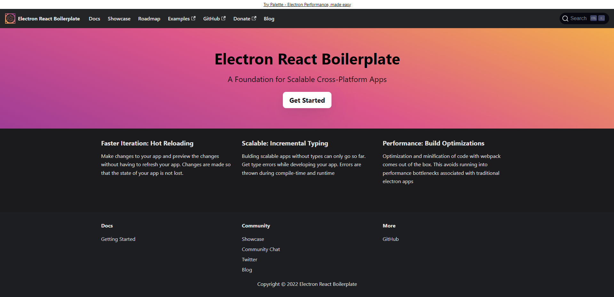

# StarWeather Electron App

# What is this?
- This is the react-weatherapp website, wrapped up with electron down create the windows desktop application.

- At some point in the future I may make this available for mac, however this is built more for demonstration and learning purposes than anything. 

# Installation
- Clone the repository, thats it. I already ran the build so if you want to check out the produciton model of this you can head to the "/release/build/win-unpacked" folder and find the executable file in their. 

# Usage
- You can use this just like the website https://starweather.azurewebsites.net/, expect now its a windows application.

---
- If you some how find this while looking for ways to use electron with react, I strongly suggest heading to the links below, there is instructions on cloning and getting a fresh template for your own project.

- For more information on how to use all the scripts and commands I recommend heading over to https://electron-react-boilerplate.js.org/. That is where I got my template to create this application.

# Bugs
- The editing portion of the profile does not check against the DB for existing emails or usernames, I have created duplicates before and things have mostly worked normal, but if I recall it can cause issue with loading favorites etc...

- For some reason with electron, the suggestions settings will revert back to the default which is set to "On". On the website, the setting is persistent when logging on and off, however the application acts differently when retrieving and setting the cookies from the DB. 

- There is no limit to the amount of favorites a user can have, so if you wanted to break the app im sure you could. I have not implemented a case for "overflow" in the user favorite section nor have I tested it. It may automatically do it, it may not.

- Note: I probably will not be fixing these for awhile as I am transitioning back into learning other languages, again this was created more for demonstration and learning. 
# Credits
- https://electron-react-boilerplate.js.org/... These guys are awesome, I was lost in the sauce trying to figure out how to wrap my project up in electron when I found them. 

- You can find their repo here: https://github.com/electron-react-boilerplate/electron-react-boilerplate

- Thank you to the creators of the template, you guys rock!

